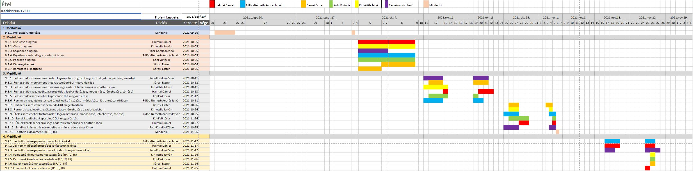

# Étel Projektterv 2021

## 1. Összefoglaló 


A weboldal arról szól, hogy a felhasználók tudnak rendelni különböző éttermek színes választékából. Ezt a partnerek látják, el tudják készíteni az ételt, majd át tudják adni a futárnak.
Az ételrendelés lényege, hogy nem kell elmenni a kiválasztott étterembe, hanem egyszerűen otthonról vagy akár a munkahelyről megrendelhetik az éhes felhasználók. Szeretnénk megkönnyebbíteni a főzni nem tudó emberek dolgát is. A legnagyobb újítás a többi ilyen oldalhoz képest, hogy döntésképtelen embereknek van egy új funkció. Egy összeghatárt beállítva a rendszer azonnal megrendel egy optimális ételt.


```
Ide írd le tömören (4-6 mondatban), hogy miről szól a projekt, amit a gyakorlatvezetőtől kaptatok. 
Írd le, hogy mik a fő célok, miért van a weboldalra szükség. 
A dokumentumban a pirossal illetve a blokkokkal kiemelt szövegeknek két jelentése van: 
(a) minta/sablon szöveg, amit le kell cserélni, pl. gyakorlatvezető neve; 
(b) segítő/magyarázó szöveg. 
Az átadott dokumentumban nem szerepelhetnek se pirossal kiemelt, se blokkban szereplő részek! A
feketével írt részek törlése tilos, azok közösek.
```

## 2. Verziók

| Verzió | Szerző(k)                | Dátum        | Státusz         | Megjegyzés                                                    |
|--------|--------------------------|--------------|-----------------|---------------------------------------------------------------|
|        |                          |              |                 |                                                               |
|        |                          |              |                 |                                                               |
|        |                          |              |                 |                                                               |
|        |                          |              |                 |                                                               |
|        |                          |              |                 |                                                               |
|        |                          |              |                 |                                                               |


Státusz osztályozás:
 - Tervezet: befejezetlen dokumentum, a mérföldkő leadása előtti napokban
 - Előterjesztés: a projekt menedzser bírálatával, a mérföldkő határidejekor
 - Elfogadott: a megrendelő által elfogadva, a prezentáció bemutatásakor

```
A leadott projekttervet véglegesnek kell tekinteni. 
Mindazonáltal indokolt esetben ettől el lehet térni, amennyiben a gyakorlatvezető engedélyezi.
A fő változtatásokat itt kell vezetni a projekt teljes ideje alatt (jelenlegi példánkban most lett vége a 2. mérföldkőnek). 
Általánosságban elmondható, hogy az első 2 mérföldkő során gyakoribb a változtatás, így legalább 
3 fő verziót érdemes megjelölni (Tervezet-Előterjesztés-Elfogadott).
A verzió számozásának következetesnek kell lennie. A szerzőknél azoknak a nevét kell felsorolni, akik hozzájárultak a fő verzióhoz,
azaz nem feltétlen mindenki, aki módosította a dokumentumot pl. egy elírás javításával. 
```

## 3. A projekt bemutatása

Ez a projektterv az Étel projektet mutatja be, mely 2021-09-01-től 2021-11-30-ig tart. A projek célja, hogy egy ételrendelő webalkalmazást készítsünk, ahol a felhasználók könnyedén megrendelhetik a kívánt ételt, a partnerek, pedig egyszerűen feldolgozhatják a megrendeléseket. A projekten hat fejlesztő fog dolgozni, az elvégzett feladatokat pedig négy alkalommal fogjuk prezentálni a megrendelőnek.

```
A megvalósítás további általános leírása, pl. mennyi főből áll a csapat, mennyi átadandó lesz a megrendelőnek a félév során, 
szintén 4-6 mondattal leírva.
```

### 3.1. Rendszerspecifikáció


A rendszernek képesnek kell lennie arra, hogy a felhasználók és a partner éttermek tudjanak regisztrálni (partnereket az adminnak jóvá kell hagynia). A partnerek tudjanak ételeket a kínálatukhoz adni, szerkeszteni, törölni, lekérni a jelenlegi megrendeléseket, a megrendelések státuszát módosítani. A felhasználók tudnak kosárba tenni ételeket és megrendelni azokat. Lehetőségük van online és készpénzes fizetésre is, megtekinthetik a korábbi rendelésüket, kedvencekhez adhatnak ételt. A döntésképtelen vásárlóknak lehetőségük van random étel rendelésére is. 

```
Ide írd le részletesen, hogy mit fog tudni a rendszer (4-6 mondatban), amit a projekt keretében kerül megvalósításra. 
Mik a megrendelő és a felhasználók igényei? Miért van szükség a projektre?
```

### 3.2. Funkcionális követelmények

 - Felhasználói munkamenet megvalósítása több jogosultsági szinttel (admin, partner, vásárló)
 - Felhasználók kezelése (CRUD)
 - Partnerek kezelése (CRUD)
 - Ételek kezelése (CRUD)
 - Rendelések kezelése (CRUD)
 - Email-es kiértesítés új rendelések esetén a vásárlónak
 - Kapcsolatfelvételi űrlap biztosítása új cégek számára
 
```
Ide kerülnek a rendszerrel szemben támasztott funkcionális igények: azaz amit a rendszernek tudnia kell.
```

### 3.3. Nem funkcionális követelmények

 - A kliens oldal platform- és böngészőfüggetlen legyen
 - Reszponzív megjelenés
 - Szenzitív adatokat biztonságosan tároljuk
 - A legfrissebb technológiákat használja a rendszer

```
A rendszer nem funkcionális követelményei, pl.: milyen környezetben fusson, milyen teljesítményt kell produkálnia, 
milyen megjelenéssel kell rendelkeznie.
```

## 4. Költség- és erőforrás-szükségletek

Az erőforrásigényünk összesen kb. 6 személynap/fő.

A rendelkezésünkre áll összesen 6 * 70 = 420 pont.

```
Becsült sarokszámok, a rendelkezésre álló erőforrás fejenként általában 17-25 személynap, 
a pontok száma = fejenként a projektre kapható maxpont * tagok száma.
```

## 5. Szervezeti felépítés és felelősségmegosztás
A projekt megrendelője Dr. Pflanzner Tamás. Az Étel projektet a projektcsapat fogja végrehajtani, amely jelenleg hat fejlesztőből áll. A csapatban csak pályakezdő webprogramozó van.
 - Halmai Dániel (0 év tapasztalat)
 - Kohl Viktória (0 év tapasztalat)
 - Fülöp-Németh András István (0 év tapasztalat)
 - Sárosi Eszter (0 év tapasztalat)
 - Kiri Attila István (0 év tapasztalat)
 - Rácz-Komlósi Zénó (1 év tapasztalat)

```
Itt lehet részletezni pl. a tagok szakmai tapasztalatait, vagy akár a releváns gyakorlati helyeket, munkahelyeket megemlíteni (4-6 mondatban).
```

### 5.1 Projektcsapat
A projekt a következő emberekből áll:

|                                                                                                                   | Név             | E-mail cím (stud-os)       |
|-------------------------------------------------------------------------------------------------------------------|-----------------|----------------------------|
| Megrendelő                                                                                                        | Dr. Pflanzner Tamás | tamas.pflanzner@inf.u-szeged.hu  |
| Felelősségek: Projekt menedzser, Back end fejlesztő 									| Halmai Dániel   | h983118@stud.u-szeged.hu |
| Front end fejlesztő és webdesigner                                				       | Kohl Viktória    | h983733@stud.u-szeged.hu |
| Devops szakértő                                                                                                    | Fülöp-Németh András István      | h982866@stud.u-szeged.hu |
| UIX designer                                                                                                   | Kiri Attila István      | h983606@stud.u-szeged.hu |
| Front end fejlesztő és webdesigner                                                                                                     | Sárosi Eszter      | h985646@stud.u-szeged.hu |
| Back end architect                                                                                                    | Rácz-Komlósi Zénó      | h985096@stud.u-szeged.hu |

```
Nem csak az adott egység felelősének feladata az adott részegység elkészítése, pl. a mérföldkövekhez tartozó prezentációt 
mindenki szerkesztheti, de elvárható, hogy a prezentációért felelős tag adja elő. 
```

## 6. A munka feltételei

### 6.1. Munkakörnyezet
A projekt a következő munkaállomásokat fogja használni a munka során:
 - Asus Rog Strix G531 laptop (CPU: i7 9750H, RAM: 16 GB, GPU: Nvidia Geforce GTX 1660Ti)
 - Windows 10 asztali gép (CPU: Ryzen 9 3900X, RAM: 32 GB, GPU: Nvidia Geforce GTX 1080Ti)


A projekt a következő technológiákat/szoftvereket fogja használni a munka során: 
 - Vercel platformszolgáltatás
 - Next JS (backend)
 - React.js-Next JS (frontend)
 - NPM szoftverprojekt menedzselő szoftver
 - VS code IDE, WebStorm IDE
 - Git verziókövető (GitLab)

```
Milyen gépet használnak a projekttagok, milyen OS-t használnak, milyen szoftverkörnyezetben, stb.
```

### 6.2. Rizikómenedzsment

| Kockázat                                    | Leírás                                                                                                                                                                                     | Valószínűség | Hatás  |
|---------------------------------------------|--------------------------------------------------------------------------------------------------------------------------------------------------------------------------------------------|--------------|--------|
| Betegség                                  | Súlyosságtól függően hátráltatja vagy bizonyos esetekben teljes mértékben korlátozza a munkavégzőt, így az egész projektre kihatással van. Megoldás: a feladatok átcsoportosítása        | nagy       | erős |
| Kommunikációs fennakadás a csapattagokkal | A csapattagok között nem elégséges az információ áramlás, nem pontosan, esetleg késve vagy nem egyértelműen tájékoztatjuk egymást. Megoldás: még gyakoribb megbeszélések és ellenőrzések | kis        | erős |
| Technikai nehézségek | Az elektronikai eszközök természetéből adódó hibákat nehéz kiküszöbölni | kis        | erős |

```
A rizikótényezők bemutatása, amely hátráltathatja a projekt befejezését. Minden rizikót érdemes megemlíteni, részletezve, hogy mit jelent, 
milyen valószínűséggel következhet be (kis, közepes és nagy) és mekkora a várható hatása (gyenge, közepes és erős) 
és hogy milyen tervvel készültök, amennyiben egy ilyen esemény bekövetkezik. Pl.: betegség, szoftver-hardver probléma, tag kiesése, stb. 
```

## 7. Jelentések

### 7.1. Munka menedzsment
A munkát Halmai Dániel koordinálja. Fő feladata, hogy folyamatosan egyeztessen a csapattagokkal az előrehaladásról és a fellépő problémákról, esetlegesen a megoldásban is segítséget nyújhat a projekt csúszásának elkerülése végett. További feladata a heti szinten tartandó csoportgyűlések időpontjának és helyszínének leszervezése, erről Discordon vagy személyesen tájékoztatja a projektcsapatot.

```
Írd le, hogy ki menedzseli a munkát (tipikusan a projekt menedzser), mik a feladatai, és azokat hogyan hajtja végre.
```

### 7.2. Csoportgyűlések

A projekt hetente ülésezik, hogy megvitassák az azt megelőző hét problémáit, illetve hogy megbeszéljék a következő hét feladatait. A megbeszélésről minden esetben memó készül.

1. megbeszélés:
 - Időpont: 2021.09.23.
 - Hely: Halmai Rezidencia - Szeged, Szilléri sugárút 21.
 - Résztvevők: Halmai Dániel, Fülöp Németh András István, Kiri Attila István, Kohl Viktória, Sárosi Eszter, Rácz-Komlósi Zénó
 - Érintett témák: Ismerkedés, A leggyengébb láncszem megtalálása

2. megbeszélés:
 - Időpont: 2021.09.27.
 - Hely: Nyugi kert - Szeged, Vitéz utca 28.
 - Résztvevők: Halmai Dániel, Fülöp Németh András István, Kohl Viktória (késett 10 percet), Kiri Attila István (késett 50 percet), Sárosi Eszter (késett 50 percet)
 - Érintett témák: A dokumentáció elkezdése, A csapat figyelmeztetése a pontosságra

3. Megbeszélés:
 - Időpont: 2021.10.03.
 - Hely: Discord
 - Résztvevők: Halmai Dániel, Fülöp Németh András István, Kiri Attila István, Sárosi Eszter, Rácz-Komlósi Zénó , Kohl Viktória
 - Érintett témák: Projektterv

4. Megbeszélés:
 - Időpont: 2021.10.17.
 - Hely: Discord
 - Résztvevők: Halmai Dániel, Fülöp Németh András István, Kiri Attila István, Sárosi Eszter, Rácz-Komlósi Zénó , Kohl Viktória
 - Érintett témák: 2. mérföldkő feladatainak átbeszélése

```
A memókat ebben a dokumentumban kell vezetni a teljes projekt során, amely tartalmazza a következőket: 
jelenlévők listája, megbeszélés helye és ideje, megbeszélt tevékenységek, felmerült kérdések és igények. 
	Lényege, hogy betekintést kapjunk hogyan szerveződnek, zajlanak a csoportgyűlések.
```

### 7.3. Minőségbiztosítás

Az elkészült terveket a terveken nem dolgozó csapattársak közül átnézik, hogy megfelel-e a specifikációnak és az egyes diagramtípusok összhangban vannak-e egymással. A meglévő rendszerünk helyes működését a prototípusok bemutatása előtt a tesztelési dokumentumban leírtak végrehajtása alapján ellenőrizzük és összevetjük a specifikációval, hogy az elvárt eredményt kapjuk-e. További tesztelési lehetőségek: unit tesztek írása az egyes modulokhoz vagy a kód közös átnézése (code review) egy, a vizsgált modul programozásában nem résztvevő csapattaggal. Szoftverünk minőségét a végső leadás előtt javítani kell a rendszerünkre lefuttatott kódelemzés során kapott metrikaértékek és szabálysértések figyelembevételével.
Az alábbi lehetőségek vannak a szoftver megfelelő minőségének biztosítására:
- Specifikáció és tervek átnézése (kötelező)
- Teszttervek végrehajtása (kötelező)
- Unit tesztek írása (választható)
- Kód átnézése (választott)

### 7.4. Átadás, eredmények elfogadása

A projekt eredményeit Dr. Pflanzner Tamás fogja elfogadni. A projektterven változásokat csak Dr. Pflanzner Tamás írásos kérés esetén Dr. Pflanzner Tamás engedélyével lehet tenni. A projekt eredményesnek bizonyul, ha specifikáció helyes és határidőn belül készül el. Az esetleges késések pontlevonást eredményeznek.
Az elfogadás feltételeire és beadás formájára vonatkozó részletes leírás a következő honlapon olvasható: https://okt.sed.hu/rf1/

### 7.5. Státuszjelentés

Minden leadásnál a projektmenedzser jelentést tesz a projekt haladásáról, és ha szükséges változásokat indítványoz a projektterven. Ezen kívül a megrendelő felszólítására a menedzser 3 munkanapon belül köteles leadni a jelentést. A gyakorlatvezetővel folytatott csapatmegbeszéléseken a megadott sablon alapján emlékeztetőt készít a csapat, amit a következő megbeszélésen áttekintenek és felmérik az eredményeket és teendőket. Továbbá gazdálkodnak az erőforrásokkal és szükség esetén a megrendelővel egyeztetnek a projektterv módosításáról.

## 8. A munka tartalma

### 8.1. Tervezett szoftverfolyamat modell és architektúra

A szoftver fejlesztése során az agilis fejlesztési modellt alkalmazzuk. A fejlesztés során nagy hangsúlyt fektetünk a folyamatos kommunikcióra. A fejlesztés során a szoftver specifikációi rugalmasan vátozhatnak, és ezzel a módszertannal tudunk a leggyorsabban alkalmazkodni az új elvárásokhoz.

A szoftver JSON REST API alapú webszolgáltatásként működik. A szerver és a kliens függetlenek, csupán API végpontok segítségével kommunikálnak.

```
Milyen szoftverfolyamat modellt követve állítja elő a csapat a specifikációnak megfelelő prototípusokat? Miért ezt választja? 
A csapat milyen architektúrát választ a projekt megvalósításához? Milyen rétegek (logikai, adat, GUI) lesznek?`
```

### 8.2. Átadandók és határidők
A főbb átadandók és határidők a projekt időtartama alatt a következők:


| Szállítandó |                 Neve                |   Határideje  |
|:-----------:|:-----------------------------------:|:-------------:|
|      D1     |       Projektterv és útmutató       | 2021-10-05   |
|    P1+D2    | UML, DB, képernyőtervek és bemutató | 2021-10-19   |
|    P1+D3    |      Prototípus I. és bemutató      | 2021-11-09   |
|    P2+D4    |      Prototípus II. és bemutató     | 2021-11-30   |

```
D - dokumentáció, P - prototípus
```

## 9. Feladatlista

A következőkben a tervezett feladatok részletes összefoglalása található.

```
Alapvetően egy feladatnak 1 felelőse lehet, de kivételt képez pl. a 9.1.1. részfeladat.`
```

### 9.1. Projektterv (1. mérföldkő)

Ennek a feladatnak az a célja, hogy megvalósításhoz szükséges lépéseket, az ütemzést és a felelősöket meghatározzuk.

Részfeladatai a következők:

#### 9.1.1. Projektterv kitöltése

Felelős: Mindenki

Tartam:  2 nap

Erőforrásigény:  0,5 személynap/fő


```
A mérföldkőhöz tartozó feladatok bemutatása PPT keretében, pl. téma, tervezett funkciók, tagok, Gantt diagram.`
```

### 9.2. UML és adatbázis tervek (2. mérföldkő)

Ennek a feladatnak az a célja, hogy a rendszerarchitektúrát, az adatbázist és webalkalmazás kinézetét megtervezzük.

Részfeladatai a következők:

#### 9.2.1. Use Case diagram

Felelős: Halmai Dániel

Tartam:  4 nap

Erőforrásigény:  1 személynap

#### 9.2.2. Class diagram

Felelős: Kiri Attila István

Tartam:  4 nap

Erőforrásigény:  2 személynap

#### 9.2.3. Sequence diagram

Felelős: Rácz-Komlósi Zénó

Tartam:  3 nap

Erőforrásigény:  1 személynap

#### 9.2.4. Egyed-kapcsolat diagram adatbázishoz

Felelős: Fülöp-Németh András István

Tartam: 4 nap

Erőforrásigény:  3 személynap

#### 9.2.5. Package diagram

Felelős: Kohl Viktória

Tartam:  4 nap

Erőforrásigény:  1 személynap

#### 9.2.6. Képernyőtervek

Felelős: Sárosi Eszter

Tartam:  3 nap

Erőforrásigény:  1 személynap

#### 9.2.7. Bemutató elkészítése

Felelős: Sárosi Eszter

Tartam:  1 nap

Erőforrásigény:  1 személynap

```
A mérföldkőhöz tartozó feladatok bemutatása PPT keretében (elkészült diagramok és képernyőtervek)`
```

### 9.3. Prototípus I. (3. mérföldkő)

Ennek a feladatnak az a célja, hogy egy működő prototípust hozzunk létre, ahol a vállalt funkcionális követelmények nagy része már prezentálható állapotban van.

Részfeladatai a következők:

#### 9.3.1.  Felhasználói munkamenet üzleti logikája több jogosultsági szinttel (admin, partner, vásárló)

Felelős: Rácz-Komlósi Zénó

Tartam:  5 nap

Erőforrásigény:  2 személynap

#### 9.3.2.  Felhasználói munkamenethez kapcsolódó GUI megvalósítása

Felelős: Sárosi Eszter

Tartam:  4 nap

Erőforrásigény:  2 személynap

#### 9.3.3.  Felhasználói munkamenethez szükséges adatok létrehozása az adatbázisban

Felelős: Kiri Attila

Tartam:  3 nap

Erőforrásigény:  1 személynap

#### 9.3.4.  Felhasználók kezeléséhez tartozó üzleti logika (listázása, módosítása, létrehozása, törlése)

Felelős: Halmai Dániel

Tartam:  4 nap

Erőforrásigény:  2 személynap

#### 9.3.5.  Felhasználók kezeléséhez kapcsolódó GUI megvalósítása

Felelős: Kohl Viktória

Tartam:  3 nap

Erőforrásigény:  1 személynap

#### 9.3.6.  Partner kezeléshez tartozó üzleti logika (listázása, módosítása, létrehozása, törlése)

Felelős: Fülöp-Németh András István

Tartam:  4 nap

Erőforrásigény:  2 személynap

#### 9.3.7.  Partner kezeléshez kapcsolódó GUI megvalósítása

Felelős: Sárosi Eszter

Tartam:  4 nap

Erőforrásigény:  2 személynap

#### 9.3.8.  Partner kezeléshez szükséges adatok létrehozása az adatbázisban

Felelős: Kiri Attila István

Tartam:  3 nap

Erőforrásigény:  1 személynap

#### 9.3.9.  Ételek kezeléséhez tartozó üzleti logika (listázása, módosítása, létrehozása, törlése)

Felelős: Fülöp-Németh András István

Tartam:  5 nap

Erőforrásigény:  2 személynap

#### 9.3.10.  Ételek kezeléshez kapcsolódó GUI megvalósítása

Felelős: Kohl Viktória

Tartam:  5 nap

Erőforrásigény:  2 személynap

#### 9.3.11.  Ételek kezeléséhez szükséges adatok létrehozása az adatbázisban

Felelős: Halmai Dániel

Tartam:  3 nap

Erőforrásigény:  1 személynap


#### 9.3.12.  Email-es kiértesítés új rendelés esetén az adott vásárlónak

Felelős: Rácz-Komlósi Zénó

Tartam:  5 nap

Erőforrásigény:  2 személynap


#### 9.3.13. Tesztelési dokumentum (TP, TC)

Felelős: Mindenki

Tartam:  3 nap

Erőforrásigény:  1 személynap/fő


```
A feladatokat a 3.2-es pont figyelembevételével érdemes meghatározni és lehető legrészletesebben definiálni a feladatokat és a felelőseit. 
A bemutató során a prototípus aktuális állását kell prezentálni.
```

### 9.4. Prototípus II. (4. mérföldkő)

Ennek a feladatnak az a célja, hogy az előző mérföldkő hiányzó funkcióit pótoljuk, illetve a hibásan működő funkciókat és az esetlegesen felmerülő új funkciókat megvalósítsuk. Továbbá az alkalmazás alapos tesztelése is a mérföldkőben történik.

Részfeladatai a következők:

#### 9.4.1. Javított minőségű prototípus új funkciókkal

Felelős: Fülöp-Németh András István

Tartam:  5 nap

Erőforrásigény:  1 személynap

#### 9.4.2. Javított minőségű prototípus javított funkciókkal

Felelős: Halmai Dániel

Tartam:  5 nap

Erőforrásigény:  2 személynap

#### 9.4.3. Javított minőségű prototípus a korábbi hiányzó funkciókkal

Felelős: Rácz-Komlósi Zénó

Tartam:  5 nap

Erőforrásigény:  2 személynap

#### 9.4.4. Felhasználói munkamenet tesztelése (TP, TC, TR)

Felelős: Kiri Attila István

Tartam:  1 nap

Erőforrásigény:  0.3 személynap

#### 9.4.5. Partnerek kezelésének tesztelése (TP, TC, TR)

Felelős: Kohl Viktória

Tartam:  1 nap

Erőforrásigény: 0.3 személynap

#### 9.4.6. Ételek kezelésének tesztelése (TP, TC, TR)

Felelős: Sárosi Eszter

Tartam:  1 nap

Erőforrásigény:  0.3 személynap

#### 9.4.7. Email-es funkciók tesztelése (TP, TC, TR)

Felelős: Halmai Dániel

Tartam:  1 nap

Erőforrásigény:  0.3 személynap


```
Működő végleges program, a frissített tesztelési dokumentációval. A 3. mérföldkőhöz képest funkiconálisan többet kell tudnia az oldalnak.

```
## 10. Részletes időbeosztás



```
Ide kell berakni a Gantt diagramot, amely a 9. fejezetben található részfeladatokat tartalmazza felelős/tartam bontásban.
```

## 11. Projekt költségvetés

```
Az egyes leadások alkalmával rögzített erőforrásigényt, az elvállalt feladatok számát 
és az adott mérföldkőben végzett munkáért szerezhető pontszámot kell beírni minden emberre külön-külön.
```

### 11.1. Részletes erőforrásigény (személynap)


|                     Név                    | 1. leadás - Projektterv | 2. leadás - UML és adatbázis | 3. leadás - Prototípus I. | 4. leadás - Prototípus II. | Összesen |
|:------------------------------------------:|:----------------------:|:--------------------------:|:-----------------------:|:------------------------:|:---------:|
|                     Halmai Dániel          |           2          |             3            |           16          |            4           |    25   |
|                     Fülöp-Németh András István           |           1          |             4            |           13          |           4           |    22  |
|                     Rácz-Komlósi Zénó             |           1          |             3            |           12          |            4           |    20   |
|                     Kohl Viktória             |           1          |             3            |           12          |            4           |    20   |
|                     Sárosi Eszter             |           1          |             3            |           12          |            4           |    20   |
|                     Kiri Attila István             |           1          |             3            |           12          |            4           |    20   |


### 11.2. Részletes feladatszámok

|                     Név                    | 1. leadás - Projektterv | 2. leadás - UML és adatbázis | 3. leadás - Prototípus I. | 4. leadás - Prototípus II. | Összesen |
|:------------------------------------------:|:----------------------:|:--------------------------:|:-----------------------:|:------------------------:|:---------:|
|                     Halmai Dániel           |           2          |             3            |           16          |            4           |    25   |
|                     Fülöp-Németh András István           |           1          |             4            |           13          |            4           |    22   |
|                     Rácz-Komlósi Zénó             |           1          |             3            |           12          |            4           |    20   |
|                     Kohl Viktória             |           1          |             3           |           12          |            4           |    20   |
|                     Sárosi Eszter             |           1          |             3            |           12          |            4           |    20   |
|                     Kiri Attila István             |           1          |             3            |           12          |            4           |    20   |

### 11.3. Részletes költségvetés

|                     Név                       | 1. leadás - Projektterv | 2. leadás - UML és adatbázis | 3. leadás - Prototípus I. | 4. leadás - Prototípus II. | Összesen |
|:---------------------------------------------:|:----------------------:|:--------------------------:|:-----------------------:|:------------------------:|:---------:|
|        Maximálisan választható pontszám %-ban |         10% (7)        |            30% (21)        |          50% (35)       |          30% (21)        | 100% (70) |
|                     Halmai Dániel           |           7          |             18            |           30          |            15           |    70   |
|                     Fülöp-Németh András István           |           7          |             18            |           30          |            15           |    70   |
|                     Rácz-Komlósi Zénó            |           7          |             17            |           31          |           15           |    70   |
|                     Kohl Viktória            |           7          |             21            |           27          |            15         |    70   |
|                     Sárosi Eszter             |           7         |            21          |           27          |            15          |    70   |
|                     Kiri Attila István             |           7         |             16            |           32          |            15          |    70   |

Szeged, 2021-10-03.
